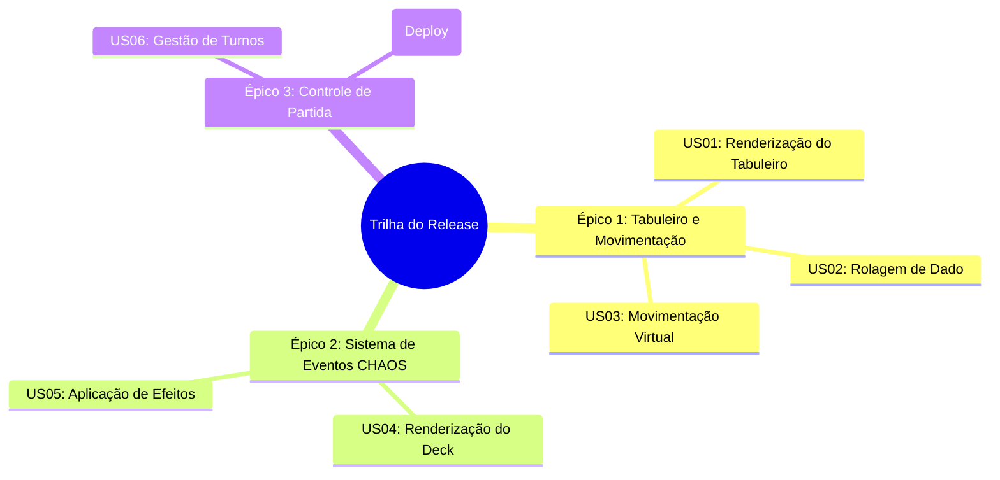

# 🚀 Trilha do Release — O Tabuleiro da Gestão Ágil

<div align="center">


</div>

---

## 📌 Apresentação Acadêmica

Este projeto foi desenvolvido como requisito de avaliação prática para o curso de pós-graduação **MBA em Gestão de Projetos de Software (MBA20-12)**.

- **Instituição:** Universidade Tecnológica Federal do Paraná (UTFPR)
- **Disciplina:** Gestão de Projetos de Software
- **Docente:** Profa. Flávia Belintani Blum Haddad
- **Tutor:** Edilson Fernandes da Costa

---

## 🎯 Sobre o Projeto

**Trilha do Release** é um jogo de tabuleiro interativo web que simula o ciclo de vida de desenvolvimento de software em equipes ágeis (Scrum/Kanban). 

O objetivo dos jogadores é avançar pelas **40 casas do tabuleiro** enfrentando imprevistos reais baseados nas estatísticas do **Relatório CHAOS** (atrasos, dívidas técnicas, refatorações, escopo truncado, testes falhos ou acelerações com boas práticas de CI/CD), até alcançar o tão esperado **DEPLOY FINAL** na casa 40.

---

## 🗺️ Escopo do Produto

### 1. Mapa de Histórias de Usuário



---

### 2. Detalhamento das User Stories (US01 a US07)

#### Épico 1: Tabuleiro e Movimentação
Abrange a interface gráfica básica e as mecânicas fundamentais para o percurso da Sprint.

| ID | História de Usuário | Critérios de Aceitação |
| :--- | :--- | :--- |
| **US01** | **Como** jogador,<br>**Eu quero** visualizar um tabuleiro digital com 40 casas numeradas,<br>**Para** acompanhar meu percurso e saber a distância até o Deploy final. | 1. O sistema deve renderizar visualmente uma trilha com 40 casas no navegador.<br>2. A casa número 40 deve estar destacada visualmente com a palavra "Deploy".<br>3. Algumas casas devem conter uma marcação visual (ícone de interrogação `?`) indicando "Casa de Evento". |
| **US02** | **Como** jogador,<br>**Eu quero** rolar um dado virtual de 6 faces (D6),<br>**Para** determinar de forma aleatória o meu nível de progresso na Sprint atual. | 1. O sistema deve exibir um botão "Rolar Dado".<br>2. Ao clicar, o sistema deve gerar um número aleatório de 1 a 6.<br>3. O resultado do dado deve ser exibido visualmente na tela de forma clara. |
| **US03** | **Como** jogador,<br>**Eu quero** que meu pino avance automaticamente no tabuleiro após a rolagem do dado,<br>**Para** refletir visualmente meu avanço no projeto. | 1. O pino do jogador atual deve avançar exatamente o número de casas correspondente ao valor tirado no dado.<br>2. O sistema deve atribuir cores distintas aos pinos caso haja mais de um jogador ativo. |

#### Épico 2: Sistema de Eventos CHAOS
Reflete a lógica do baralho baseada nas estatísticas do Relatório CHAOS, aplicando restrições e acelerações aos jogadores.

| ID | História de Usuário | Critérios de Aceitação |
| :--- | :--- | :--- |
| **US04** | **Como** jogador,<br>**Eu quero** comprar e visualizar uma carta do "Deck CHAOS" ao cair em uma casa marcada,<br>**Para** vivenciar as imprevisibilidades e estatísticas de sucesso/falha de um projeto real. | 1. O sistema deve armazenar a lógica de 20 cartas distintas baseadas no Relatório CHAOS.<br>2. Quando um jogador parar em uma "Casa de Evento", um modal (pop-up) deve aparecer exibindo o Título da Carta e seu Texto Descritivo. |
| **US05** | **Como** jogador,<br>**Eu quero** que o efeito da carta CHAOS seja aplicado automaticamente ao meu pino,<br>**Para** simular o impacto de boas ou más práticas na minha Sprint. | 1. Se a carta for de aceleração (sucesso), o sistema deve avançar o pino em X casas estipuladas na carta.<br>2. Se a carta for de impedimento (falha), o sistema deve retroceder o pino em Y casas ou aplicar o status "Perde a próxima vez". |

#### Épico 3: Controle de Partida
Gerencia o estado geral do jogo, entrada de usuários e a finalização.

| ID | História de Usuário | Critérios de Aceitação |
| :--- | :--- | :--- |
| **US06** | **Como** Scrum Master (Host),<br>**Eu quero** definir a quantidade de jogadores e seus nomes ao iniciar o jogo,<br>**Para que** o sistema controle de quem é o turno e gerencie a partida corretamente. | 1. A tela inicial deve permitir o cadastro de 1 a 4 jogadores.<br>2. O sistema deve possuir um controle de estado que indica claramente na tela de cual jogador é o turno atual.<br>3. O botão "Rolar Dado" (US02) só deve processar a ação para o jogador que possui o turno. |
| **US07** | **Como** jogador,<br>**Eu quero** ser notificado assim que eu alcançar ou ultrapassar a casa 40,<br>**Para** celebrar o Deploy bem-sucedido e ser declarado o vencedor da partida. | 1. Se a rolagem do dado (somada a possíveis efeitos de cartas) fizer o pino chegar à casa 40 ou além, o jogo deve ser pausado.<br>2. O sistema deve exibir uma tela de vitória parabenizando o jogador com a mensagem "Deploy Realizado!".<br>3. Deve ser exibido um botão para reiniciar a partida. |

---

## ✨ Destaques de UX, Design e Recursos

- 🎨 **Estética Neo-Brutalista Cartoon 1930s:** Cores vibrantes, sombras pop (`box-shadow: 6px 6px 0px #1C1917`), bordas marcantes e tipografia vintage (`Luckiest Guy` & `Courier Prime`).
- 🎲 **Animação do Dado com Suspense e Desaceleração:** O giro do dado desacelera suavemente e realiza provocações dramáticas (*tease faces*) na reta final da disputa perto do Deploy.
- 🔊 **Efeitos Sonoros com Web Audio API:** Síntese sonora procedural de latência zero sem arquivos externos pesados (rolagem do dado, pulo do peão, evento, virada de carta, vinheta de turno e fanfarra de vitória). Inclui controle de Mute/Unmute no HUD com persistência em `localStorage`.
- 📱 **Layout 100% Responsivo:** Trilha ajustada dinamicamente para telas Desktop (4 linhas), Tablet (6 linhas) e Mobile (10 linhas serpenteantes).
- 🏷️ **Customização dos Jogadores:** Cadastro de 1 a 4 jogadores com escolha exclusiva de avatares (🚀 Foguete, ⚡ Raio, 👑 Coroa, 🛠️ Ferramentas, 🏆 Troféu) e paletas de cores vintage.

---

## 🛠️ Tecnologias Utilizadas

- **Framework:** [Next.js 16 (App Router)](https://nextjs.org/)
- **Biblioteca UI:** [React 19](https://react.dev/)
- **Linguagem:** [TypeScript](https://www.typescriptlang.org/)
- **Estilização:** [Tailwind CSS 4](https://tailwindcss.com/)
- **Gerenciamento de Estado:** [Zustand](https://zustand-demo.pmnd.rs/)
- **Animações:** [Framer Motion](https://www.framer.com/motion/) & [Canvas-Confetti](https://www.npmjs.com/package/canvas-confetti)
- **Ícones:** [Lucide React](https://lucide.dev/)
- **Efeitos Sonoros:** Web Audio API (Sintetizador Procedural)
- **Testes Unitários:** [Vitest](https://vitest.dev/)
- **Linter:** ESLint

---

## 📂 Estrutura do Projeto

```text
trilha-release/
├── src/
│   ├── app/                    # Layout raiz, fontes e favicon
│   ├── components/
│   │   ├── common/             # Ícones genéricos e utilitários UI
│   │   └── game/               # Componentes do jogo (HUD, GameBoard, Pawn, Modais)
│   ├── data/                   # Configuração do tabuleiro, cartas CHAOS e avatares
│   ├── store/                  # Engine e estado global da partida (Zustand)
│   ├── types/                  # Definições de tipos TypeScript
│   └── utils/                  # Sintetizador de áudio Web Audio API (soundManager)
├── public/                     # Ativos estáticos e favicon
├── vitest.config.ts            # Configuração da suíte de testes Vitest
└── package.json
```

---

## 🚀 Como Executar o Projeto Localmente

### Pré-requisitos
- Node.js (versão 18.x ou superior)
- Gerenciador de pacotes `npm` ou `yarn`

### Passos para execução:

1. **Clonar o repositório:**
   ```bash
   git clone git@github.com:gustavofariaa/MBA20-12.git
   cd MBA20-12
   ```

2. **Instalar as dependências:**
   ```bash
   npm install
   ```

3. **Iniciar o servidor de desenvolvimento:**
   ```bash
   npm run dev
   ```

4. **Acessar a aplicação:**
   Abra [http://localhost:3000](http://localhost:3000) no seu navegador.

---

## 🧪 Execução de Testes Automatizados

O projeto conta com uma suíte de testes unitários desenvolvida com **Vitest** cobrindo todas as regras de negócio do motor do jogo (`useGameStore`).

Para rodar a suíte de testes:

```bash
# Executar todos os testes unitários
npx vitest run

# Executar a verificação de código (ESLint)
npm run lint
```

---

<div align="center">

Desenvolvido para o **MBA em Gestão de Projetos de Software (UTFPR)**.

</div>
