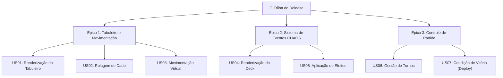

# 🎲 Trilha do Release — O Tabuleiro da Gestão Ágil

---

## 📌 Contexto do Projeto

Este projeto foi desenvolvido como instrumento de aprendizado e avaliação para o curso de pós-graduação **MBA em Gestão de Projetos de Software (MBA20-12)**.

- **Instituição:** Universidade Tecnológica Federal do Paraná (UTFPR)
- **Disciplina:** Gestão de Projetos de Software
- **Docente:** Profa. Flávia Belintani Blum Haddad
- **Tutor:** Edilson Fernandes da Costa

---

## 💡 Propósito e Conceito

O **Trilha do Release** é um jogo de tabuleiro interativo desenvolvido para transformar o aprendizado de Gestão Ágil de Software em uma experiência lúdica, envolvente e dinâmica.

### Qual o objetivo do jogo?
Simular o percurso real de uma equipe de desenvolvimento ao longo do ciclo de vida de um software. Os jogadores assumem papéis no projeto e avançam por uma trilha de **40 casas**, enfrentando os desafios, imprevistos e sucessos típicos da gestão de projetos até alcançar a vitória com o **DEPLOY FINAL** na casa 40.

### O que o jogo simula?
- **Ritmo de Sprint:** A rolagem do dado de 6 faces representa a capacidade produtiva e as entregas da equipe a cada turno.
- **Relatório CHAOS (Eventos do Projeto):** Casas especiais de evento ativam cartas de imprevistos inspirados em dados reais da indústria de software. As cartas simulam desde **acelerações** (boas práticas de CI/CD, automações e entrosamento) até **impedimentos** (dívida técnica, requisitos ambíguos, falhas em produção ou rotatividade de membros), exigindo resiliência e adaptação da equipe.
- **Competição e Colaboração:** De 1 a 4 jogadores disputam o avanço na trilha, permitindo visualizar quem consegue gerenciar melhor os riscos da Sprint para chegar primeiro ao Deploy.

---

## 🗺️ Escopo do Produto

### 1. Mapa de Histórias de Usuário

---

### 2. Detalhamento das User Stories (US01 a US07)

#### Épico 1: Tabuleiro e Movimentação
Interface gráfica e mecânicas fundamentais para o percurso da Sprint.

| ID | História de Usuário | Critérios de Aceitação |
| :--- | :--- | :--- |
| **US01** | **Como** jogador, **Eu quero** visualizar um tabuleiro digital com 40 casas numeradas, **Para** acompanhar meu percurso e saber a distância até o Deploy final. | 1. O sistema deve renderizar visualmente uma trilha com 40 casas no navegador. 2. A casa número 40 deve estar destacada visualmente com a palavra "Deploy". 3. Algumas casas devem conter uma marcação visual (ícone de interrogação `?`) indicando "Casa de Evento". |
| **US02** | **Como** jogador, **Eu quero** rolar um dado virtual de 6 faces (D6), **Para** determinar de forma aleatória o meu nível de progresso na Sprint atual. | 1. O sistema deve exibir um botão "Rolar Dado". 2. Ao clicar, o sistema deve gerar um número aleatório de 1 a 6. 3. O resultado do dado deve ser exibido visualmente na tela de forma clara. |
| **US03** | **Como** jogador, **Eu quero** que meu pino avance automaticamente no tabuleiro após a rolagem do dado, **Para** refletir visualmente meu avanço no projeto. | 1. O pino do jogador atual deve avançar exatamente o número de casas correspondente ao valor tirado no dado. 2. O sistema deve atribuir cores distintas aos pinos caso haja mais de um jogador ativo. |

#### Épico 2: Sistema de Eventos CHAOS
Reflete a lógica do baralho baseada nas estatísticas do Relatório CHAOS, aplicando restrições e acelerações aos jogadores.

| ID | História de Usuário | Critérios de Aceitação |
| :--- | :--- | :--- |
| **US04** | **Como** jogador, **Eu quero** comprar e visualizar uma carta do "Deck CHAOS" ao cair em uma casa marcada, **Para** vivenciar as imprevisibilidades e estatísticas de sucesso/falha de um projeto real. | 1. O sistema deve armazenar a lógica de 20 cartas distintas baseadas no Relatório CHAOS. 2. Quando um jogador parar em uma "Casa de Evento", um modal (pop-up) deve aparecer exibindo o Título da Carta e seu Texto Descritivo. |
| **US05** | **Como** jogador, **Eu quero** que o efeito da carta CHAOS seja aplicado automaticamente ao meu pino, **Para** simular o impacto de boas ou más práticas na minha Sprint. | 1. Se a carta for de aceleração (sucesso), o sistema deve avançar o pino em X casas estipuladas na carta. 2. Se a carta for de impedimento (falha), o sistema deve retroceder o pino em Y casas ou aplicar o status "Perde a próxima vez". |

#### Épico 3: Controle de Partida
Gerencia o estado geral do jogo, entrada de usuários e a finalização.

| ID | História de Usuário | Critérios de Aceitação |
| :--- | :--- | :--- |
| **US06** | **Como** Scrum Master (Host), **Eu quero** definir a quantidade de jogadores e seus nomes ao iniciar o jogo, **Para que** o sistema controle de quem é o turno e gerencie a partida corretamente. | 1. A tela inicial deve permitir o cadastro de 1 a 4 jogadores. 2. O sistema deve possuir um controle de estado que indica claramente na tela de qual jogador é o turno atual. 3. O botão "Rolar Dado" (US02) só deve processar a ação para o jogador que possui o turno. |
| **US07** | **Como** jogador, **Eu quero** ser notificado assim que eu alcançar ou ultrapassar a casa 40, **Para** celebrar o Deploy bem-sucedido e ser declarado o vencedor da partida. | 1. Se a rolagem do dado (somada a possíveis efeitos de cartas) fizer o pino chegar à casa 40 ou além, o jogo deve ser pausado. 2. O sistema deve exibir uma tela de vitória parabenizando o jogador com a mensagem "Deploy Realizado!". 3. Deve ser exibido um botão para reiniciar a partida. |

---

## 🎨 Experiência do Jogador (UX & Visual)

- **Identidade Vintage Cartoon Anos 30:** Interface inspirada nos desenhos clássicos da década de 1930, combinando nostalgia, dinamismo e uma linguagem visual marcante.
- **Narrativa e Imersão:** Sons procedurais retro (dados rolando, pulo dos peões, abertura de cartas e vitória), animações dramáticas na rolagem de dados e cartas de evento detalhadas que conectam a jogabilidade aos conceitos de Gestão Ágil.
- **Personalização de Partida:** Suporte para 1 a 4 jogadores com escolha individual de nomes, cores e avatares temáticos.

---

Desenvolvido para o **MBA em Gestão de Projetos de Software (UTFPR)**.

